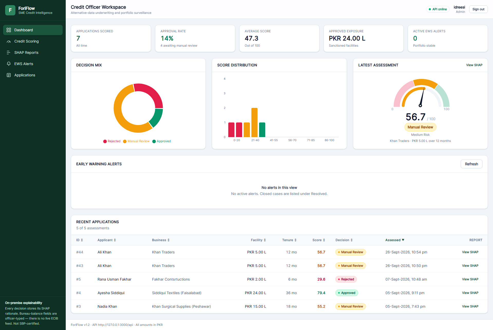
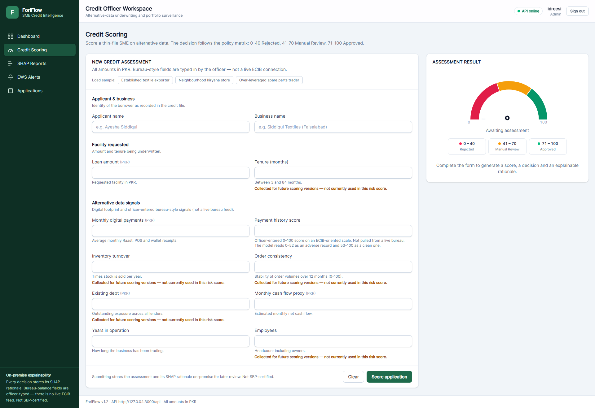
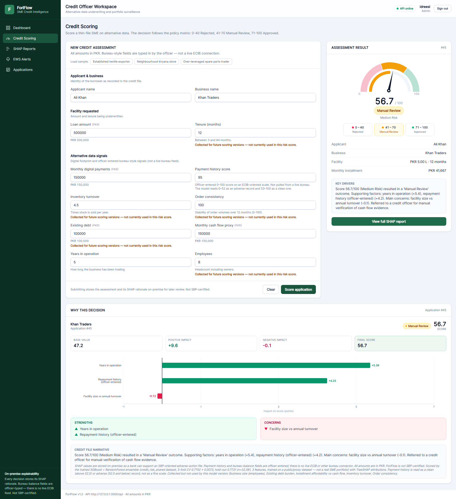
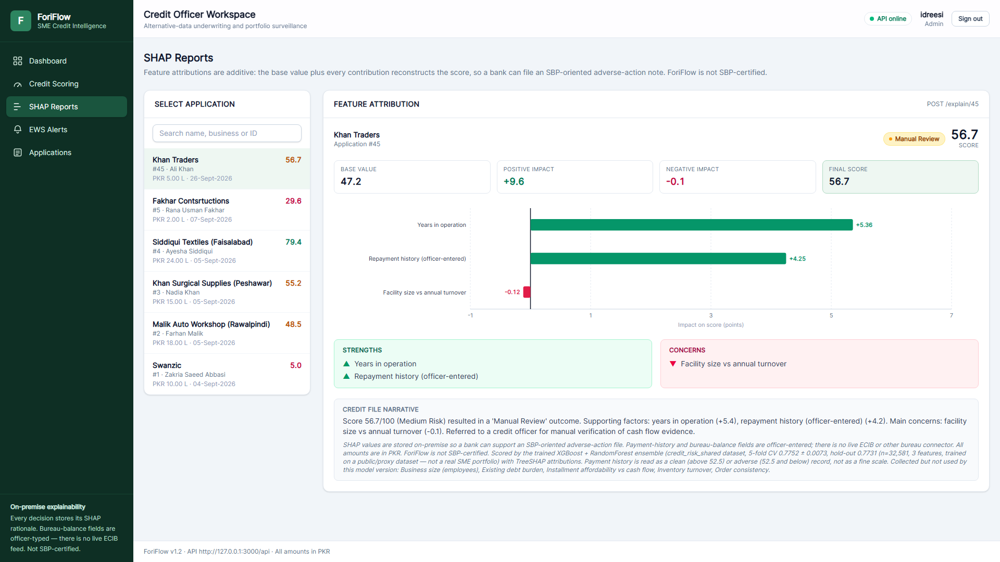
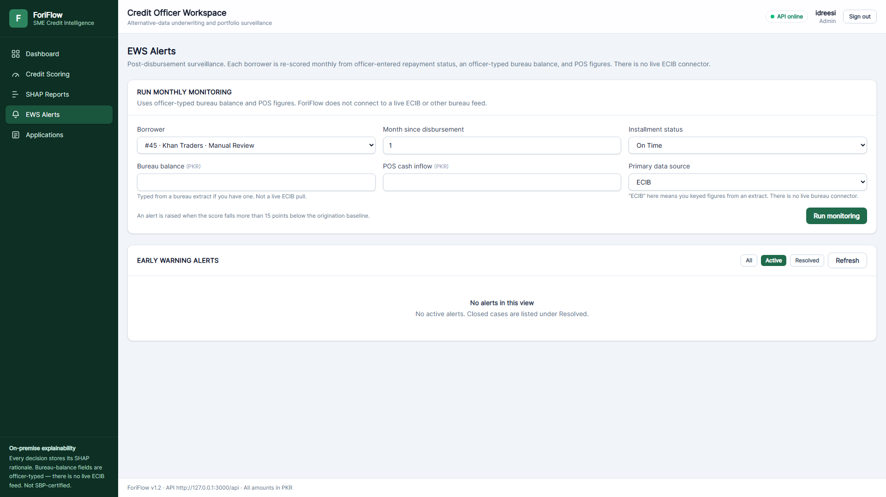
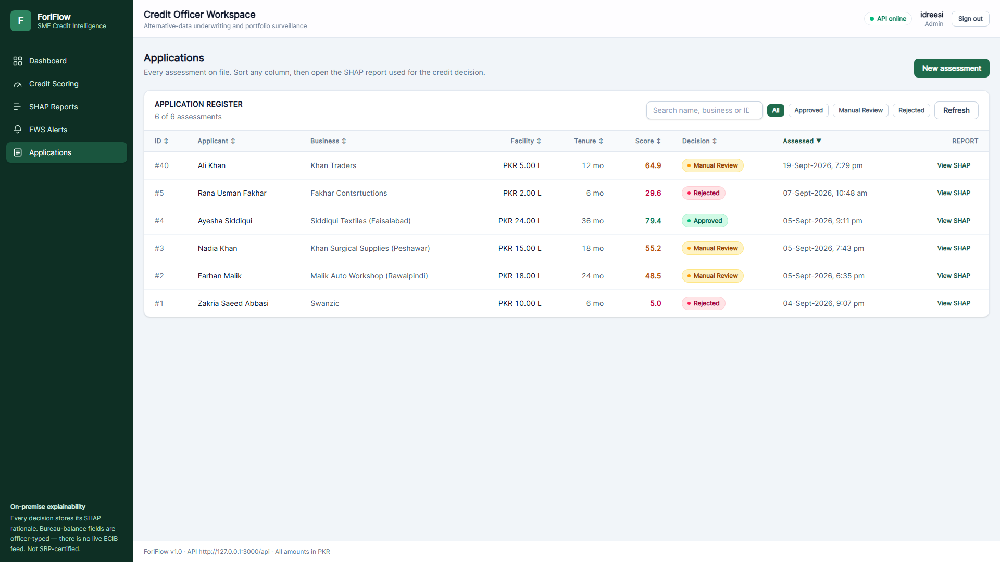
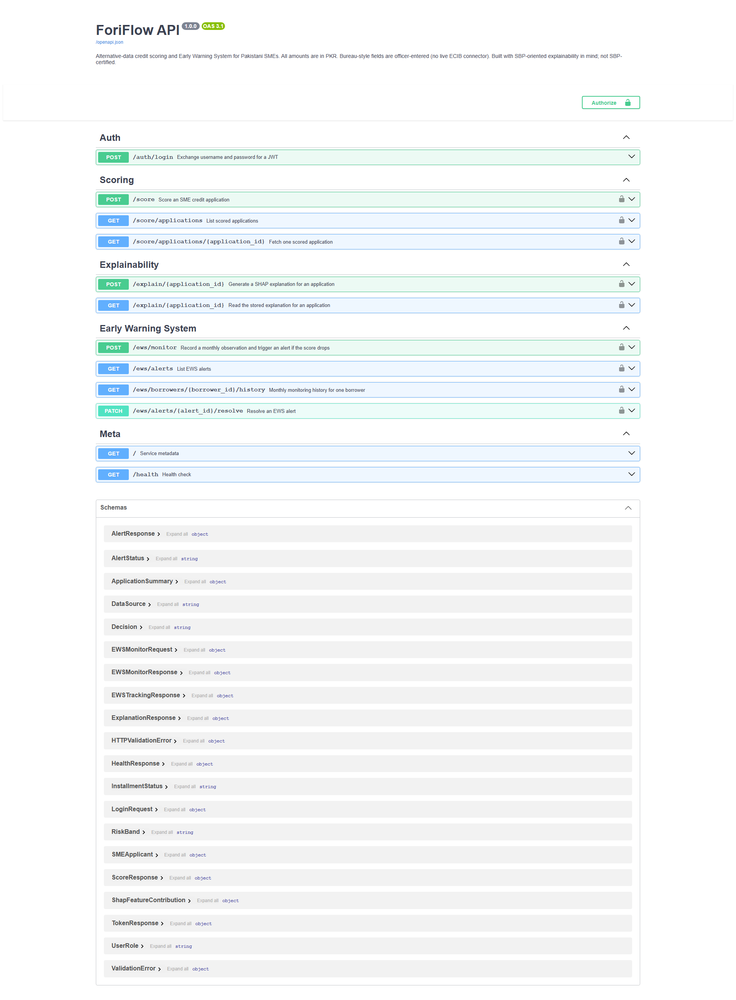

# ForiFlow 🏦🤖

> AI-Powered SME Credit Scoring & Early Warning System for Pakistani Banks

[](https://fastapi.tiangolo.com)
[](https://react.dev)
[](https://xgboost.readthedocs.io)
[](https://shap.readthedocs.io)
[](https://www.docker.com)

## 🎯 Problem Statement

Pakistani SMEs face a critical financing gap:

- **60%** of SME loan applications are rejected due to lack of collateral
- **14-17%** NPL ratio in the microfinance sector
- **90 days** average time to detect portfolio deterioration
- **SBP mandates** explainable AI for all credit decisions

## 💡 Solution

ForiFlow is an end-to-end AI credit intelligence platform that:

- Scores unbanked SMEs using **alternative data** (digital payments and other officer-entered signals)
- Provides **SHAP explainability** for every decision, stored on-premise to support an SBP-oriented review (ForiFlow is not SBP-certified and has no live ECIB connector)
- Monitors approved borrowers with an **Early Warning System** that detects defaults 60-90 days in advance

## 🏗️ Architecture

```
┌─────────────┐      REST API       ┌─────────────┐
│   React 18  │ ◄─────────────────► │   FastAPI   │
│  Dashboard  │   /score /explain   │   Backend   │
└─────────────┘                     └──────┬──────┘
                                           │
                 ┌─────────────────────────┼─────────────────────────┐
                 ▼                         ▼                         ▼
          ┌─────────────┐           ┌─────────────┐           ┌─────────────┐
          │ XGBoost+RF  │           │    SHAP     │           │  PostgreSQL │
          │  Ensemble   │           │TreeExplainer│           │   SQLite    │
          │ CV 0.7758*  │           │             │           │   (Dev)     │
          └─────────────┘           └─────────────┘           └─────────────┘
```

\* 5-fold CV 0.7758 ± 0.0075, hold-out 0.7756 (n=32,581, 3 features, trained on a public/proxy dataset — not a real SME portfolio).

In Docker the dashboard calls `/api` on its own origin and nginx forwards that
prefix to FastAPI, so a bank laptop never has to configure CORS.

## ✨ Key Features

| Feature | Description |
|---------|-------------|
| 🎯 **AI Credit Scoring** | XGBoost + Random Forest soft-voting ensemble. Score: 0-100 |
| 📊 **SHAP Waterfall Charts** | Every decision explained with feature attribution |
| 🚨 **Early Warning System** | Monthly re-scoring. Alert triggered on >15 point drop |
| 🏦 **PKR Banking Context** | Built for Pakistani financial regulations |
| 🐳 **Docker Ready** | One-command deployment for bank demos |
| 🔐 **JWT Authentication** | Role-based access (Admin/Manager/Officer) — on the roadmap |

## 🛠️ Tech Stack

| Layer | Technology |
|-------|-----------|
| **Frontend** | React 18, Vite, Tailwind CSS, Recharts, Axios |
| **Backend** | Python 3.11, FastAPI, SQLAlchemy, Pydantic |
| **ML** | XGBoost, Random Forest, SHAP, scikit-learn, imbalanced-learn |
| **Database** | SQLite (development), PostgreSQL (production) |
| **DevOps** | Docker, Docker Compose, GitHub Actions |

## 📸 Screenshots










## 🚀 Quick Start

```bash
git clone https://github.com/Idreesi8/foriflow.git
cd foriflow
docker compose up --build -d
```

Visit: [http://127.0.0.1:3000](http://127.0.0.1:3000)

On Windows, double-click `start.bat` (or the desktop **ForiFlow** shortcut
from `create-shortcut.bat`). That starts existing images without rebuilding.
After code changes, use `rebuild.bat`.
Confirm the trained ensemble is live with:

```bash
docker compose logs backend | grep "Scoring engine ready"
```

You want `ensemble-xgb-rf-...`, not `surrogate-linear-v1`. Train the artefacts
first if you cloned a fresh copy (`cd backend && python -m ml.train_real_model`)
— they are gitignored.

Without Docker: `uvicorn main:app --port 8000` in `backend/` and `npm run dev`
in `frontend/`. Vite proxies `/api` to the API.

## 📊 Performance

- **AUC-ROC:** 5-fold CV 0.7758 ± 0.0075, hold-out 0.7756 (n=32,581, 3 features, trained on a public/proxy dataset — not a real SME portfolio). 0.85+ remains a bank-data target, not a measured result.
- **Response time:** under 2 seconds per score after the ensemble is loaded
- **Concurrent users:** designed for 1,000+ officers behind a reverse proxy

## 📁 Project Structure

```
foriflow/
├── backend/           # FastAPI + ML
├── frontend/          # React Dashboard
├── docker-compose.yml
├── docs/              # Architecture, API, deployment
├── linkedin/          # Profile copy and launch posts
└── scripts/           # Screenshot capture and repo setup
```

## 🗺️ Roadmap

- [x] MVP with real ML model
- [x] Docker containerization
- [x] SHAP explainability
- [x] EWS monitoring
- [ ] JWT Authentication & RBAC
- [ ] PostgreSQL migration
- [ ] ECIB integration
- [ ] Mobile responsive + Urdu support

## 👤 Author

**Ramzan Idreesi** — AI Software Engineer | Full-Stack Developer

[GitHub](https://github.com/Idreesi8) · [LinkedIn](https://www.linkedin.com/in/ramzan-idreesi-0b0245328)

## 📄 License

MIT License © 2026 Ramzan Idreesi
