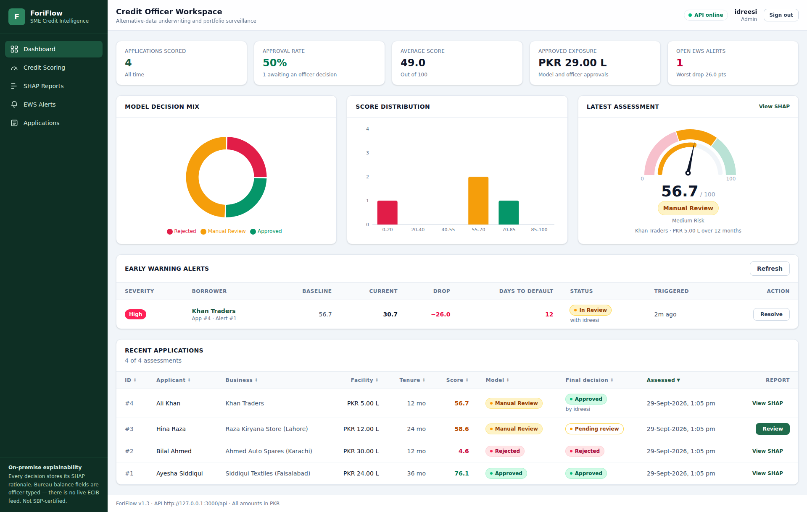
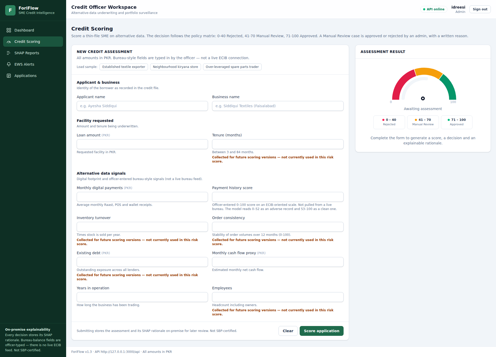
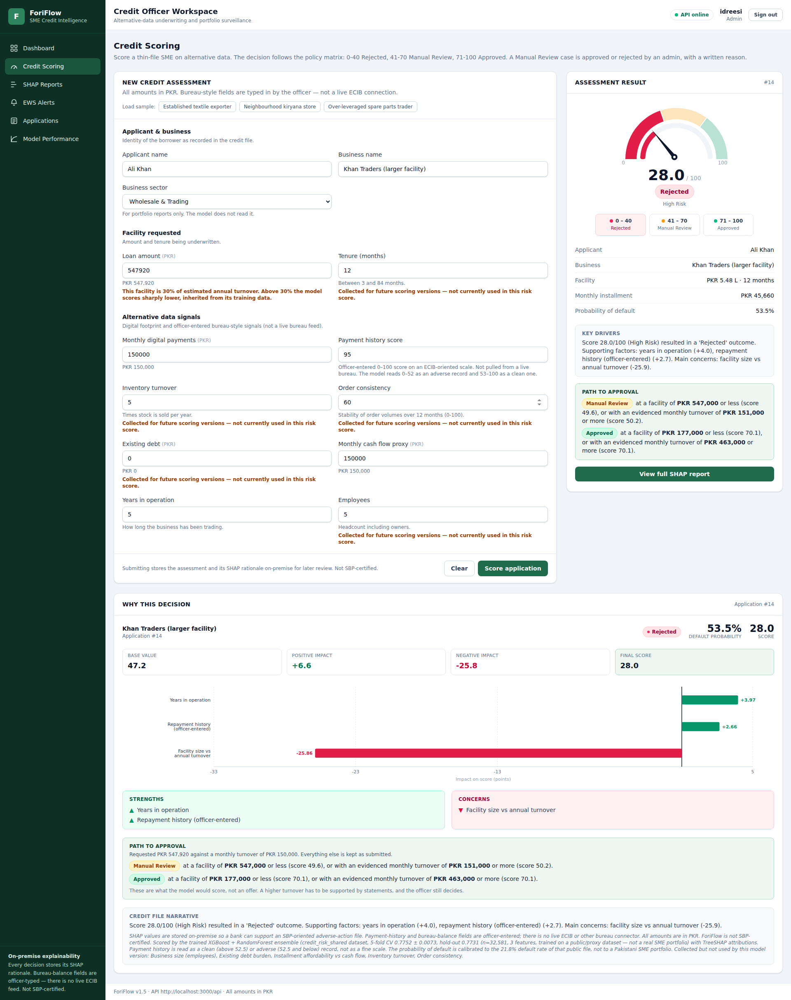
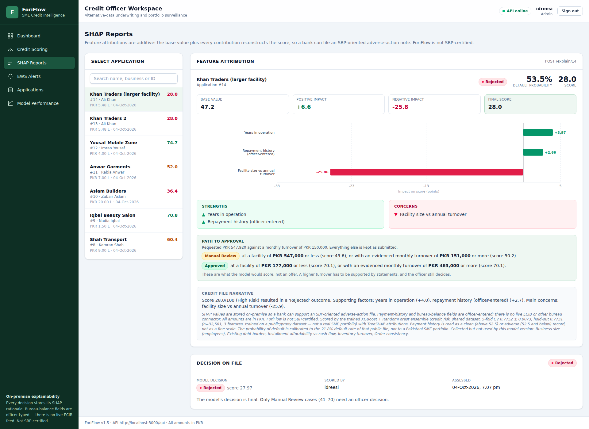
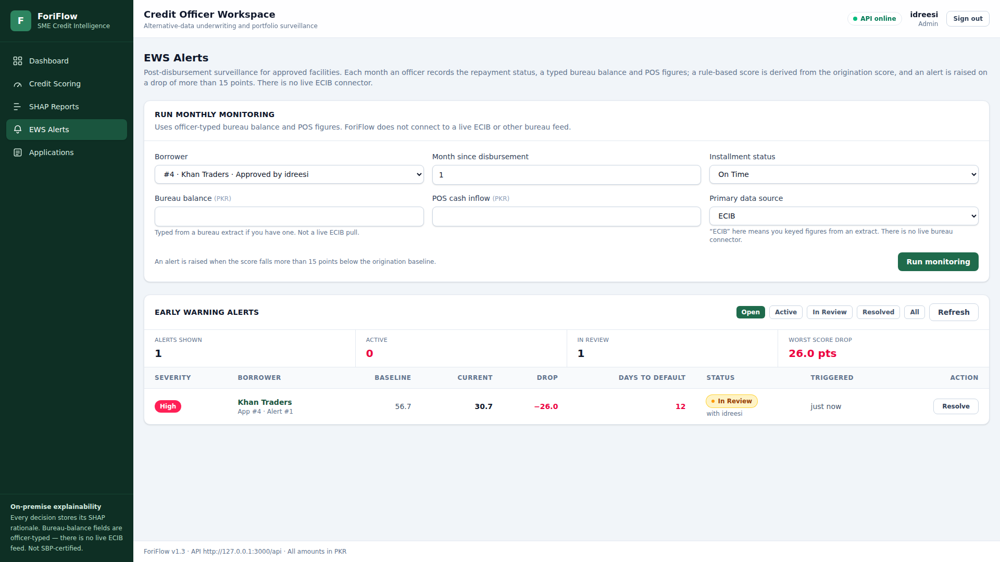
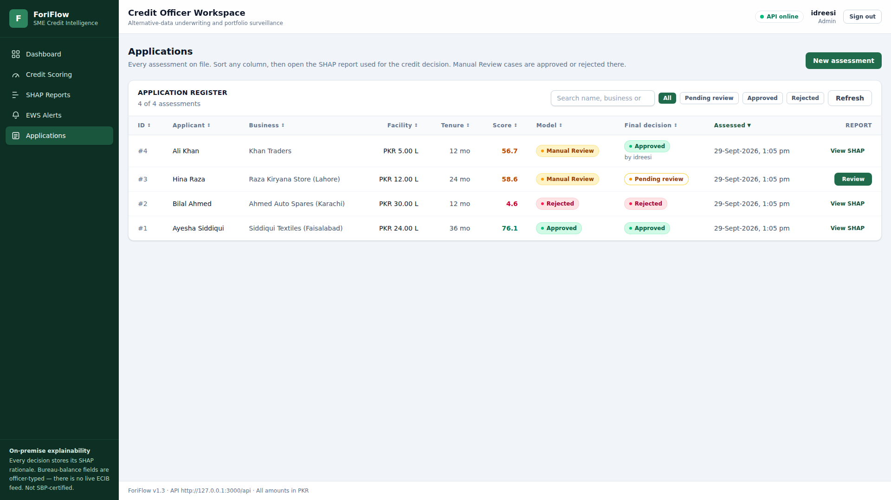
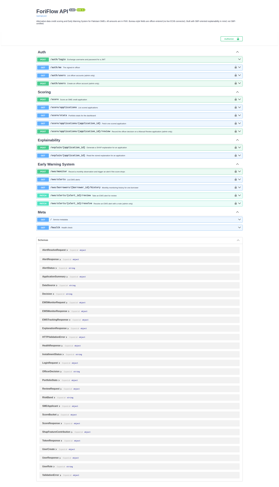
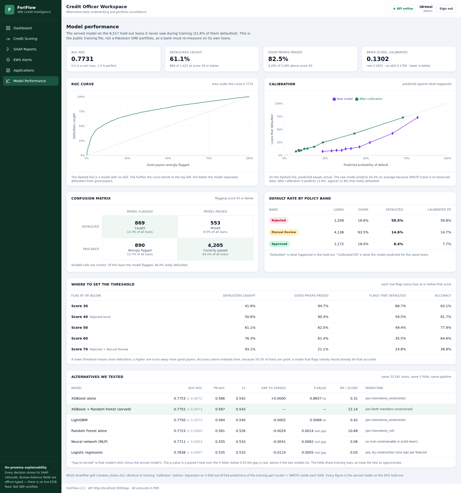

# ForiFlow 🏦🤖

> AI-Powered SME Credit Scoring & Early Warning System for Pakistani Banks

[](https://fastapi.tiangolo.com)
[](https://react.dev)
[](https://xgboost.readthedocs.io)
[](https://shap.readthedocs.io)
[](https://www.docker.com)

## 🎯 Problem Statement

Pakistani SMEs face a financing gap:

- Many have no collateral and a thin or informal credit file, so a collateral-led
  scorecard has little to go on
- Their digital footprint (Raast, POS and wallet receipts) is rarely part of the
  credit decision
- Deterioration after disbursement is often noticed only once installments are
  already late
- Lenders need to explain automated credit decisions. The State Bank of Pakistan
  was reported in April 2025 to be finalising guidelines for responsible AI use in
  financial services, aimed at "trust, transparency, and accountability"
  ([Dawn](https://www.dawn.com/news/1906849)); no final SBP rule mandating
  explainable AI for credit decisions has been verified for this project

## 💡 Solution

ForiFlow is an end-to-end AI credit intelligence platform that:

- Scores unbanked SMEs using **alternative data** (digital payments and other officer-entered signals)
- Provides **SHAP explainability** for every decision, stored on-premise to support an SBP-oriented review (ForiFlow is not SBP-certified and has no live ECIB connector)
- Monitors approved borrowers (model-approved, or Manual Review approved by an officer) with an **Early Warning System** that raises an alert when the monthly score drops more than 15 points below origination, with an estimated runway to default (a heuristic, not validated on repayment data)

## 🏗️ Architecture

```
┌─────────────┐      REST API       ┌─────────────┐
│   React 18  │ ◄─────────────────► │   FastAPI   │
│  Dashboard  │   /score /explain   │   Backend   │
└─────────────┘                     └──────┬──────┘
                                           │
                 ┌─────────────────────────┼─────────────────────────┐
                 ▼                         ▼                         ▼
          ┌─────────────┐           ┌─────────────┐           ┌─────────────┐
          │ XGBoost+RF  │           │    SHAP     │           │ PostgreSQL  │
          │  Ensemble   │           │TreeExplainer│           │     16      │
          │ CV 0.7752*  │           │             │           │  (Docker)   │
          └─────────────┘           └─────────────┘           └─────────────┘
```

\* 5-fold CV 0.7752 ± 0.0073, hold-out 0.7731 (n=32,581, 3 features, trained on a public/proxy dataset — not a real SME portfolio).

In Docker the dashboard calls `/api` on its own origin and nginx forwards that
prefix to FastAPI, so a bank laptop never has to configure CORS.

## ✨ Key Features

| Feature | Description |
|---------|-------------|
| 🎯 **AI Credit Scoring** | XGBoost + Random Forest soft-voting ensemble. Score: 0-100 |
| 📊 **SHAP Waterfall Charts** | Every decision explained with feature attribution |
| 📈 **Calibrated PD & Model Performance** | Each score carries a probability of default calibrated on out-of-fold predictions; a Model Performance page shows the hold-out ROC curve, confusion matrix, threshold table, default rate per band and the six-model comparison |
| 🧭 **Path to approval** | For a rejected or referred applicant, the exact facility size and the evidenced turnover at which the same business would reach the next band, found by searching the monotone model |
| 💼 **Loan book analytics** | Disbursed, collected, overdue and outstanding amounts, portfolio at risk (30+ days), defaults, a decision matrix and a per-sector table, from the months officers record |
| ✅ **Officer decision on Manual Review** | An admin approves or rejects each 41–70 case with a written reason; the model band, the officer's call, name and time are all kept, and only approved facilities can be monitored |
| 🚨 **Early Warning System** | Officer-submitted monthly observation; a rule-based score is derived from the origination baseline and an alert fires on a >15-point drop |
| 🏦 **PKR Banking Context** | PKR amounts; designed for SBP-oriented explainability (not SBP-certified, no live ECIB feed) |
| 🐳 **Docker Ready** | One-command deployment for bank demos |
| 🔐 **JWT Authentication** | On-premise login (bcrypt, HS256, 8-hour tokens); roles admin and analyst, with Manual Review decisions, resolving alerts and creating officer accounts admin-only; every assessment records who scored it |

## 🛠️ Tech Stack

| Layer | Technology |
|-------|-----------|
| **Frontend** | React 18, Vite, Tailwind CSS, Recharts, Axios |
| **Backend** | Python 3.12, FastAPI, SQLAlchemy 2, Pydantic 2, Alembic, PyJWT, passlib/bcrypt |
| **ML** | XGBoost 3.4, scikit-learn 1.8 (Random Forest), SHAP TreeExplainer, imbalanced-learn (SMOTE) |
| **Database** | PostgreSQL 16 in Docker (schema owned by Alembic); SQLite only for runs without Docker and for tests |
| **DevOps** | Docker, Docker Compose, nginx (serves the dashboard, proxies `/api`), GitHub Actions |

## 📸 Screenshots











## 🚀 Quick Start

```bash
git clone https://github.com/Idreesi8/foriflow.git
cd foriflow
docker compose up --build -d
```

Visit: [http://127.0.0.1:3000](http://127.0.0.1:3000)

On Windows, double-click `start.bat` (or the desktop **ForiFlow** shortcut
from `create-shortcut.bat`). That starts existing images without rebuilding.
After code changes, use `rebuild.bat`.
To see what is stored in PostgreSQL (applications with their SHAP explanations,
EWS records, alerts, bcrypt-hashed officer accounts), run `show-data.bat`; the
read-only queries are in `scripts/show-data.sql`.
Confirm the trained ensemble is live with:

```bash
docker compose logs backend | grep "Scoring engine ready"
```

You want `ensemble-xgb-rf-...`, not `surrogate-linear-v1`. The trained
artefacts are committed in `backend/ml/`, so a fresh clone serves the real
ensemble. To retrain them, see "Training data" in
[`backend/README.md`](backend/README.md).

Without Docker: `uvicorn main:app --port 8000` in `backend/` and `npm run dev`
in `frontend/`. Vite proxies `/api` to the API.

## 📊 Performance

- **AUC-ROC:** 5-fold CV 0.7752 ± 0.0073, hold-out 0.7731 (n=32,581, 3 features, trained on a public/proxy dataset — not a real SME portfolio). 0.85+ remains a bank-data target, not a measured result.
- **Calibration (hold-out, 6,517 loans):** Brier 0.1852 raw → 0.1302 after isotonic calibration (0.1706 for always predicting the base rate). Observed default rate: Rejected 59.5%, Manual Review 14.6%, Approved 8.4%. Calibrated to the public file's 21.8% default rate, not to Pakistani SMEs.
- **Response time:** median 150 ms, p90 207 ms per score including SHAP (30 runs in the Docker container on the development laptop, 26 September 2026)
- **Concurrency:** not load-tested; the shipped Compose stack runs a single uvicorn process behind nginx, sized for a single-branch pilot

## 📁 Project Structure

```
foriflow/
├── backend/           # FastAPI + ML
├── frontend/          # React Dashboard
├── docker-compose.yml
├── docs/              # Architecture, API, deployment
├── linkedin/          # Profile copy and launch posts
└── scripts/           # Screenshot capture and repo setup
```

## 🗺️ Roadmap

- [x] MVP with real ML model
- [x] Docker containerization
- [x] SHAP explainability
- [x] EWS monitoring
- [x] JWT authentication with admin and analyst roles
- [x] PostgreSQL 16 with Alembic migrations
- [ ] Retrain on labelled Pakistani SME loan data
- [ ] ECIB integration
- [ ] Mobile responsive + Urdu support

## 👤 Author

**Ramzan Idreesi** — AI Software Engineer | Full-Stack Developer

[GitHub](https://github.com/Idreesi8) · [LinkedIn](https://www.linkedin.com/in/ramzan-idreesi-0b0245328)

## 📄 License

MIT License © 2026 Ramzan Idreesi
