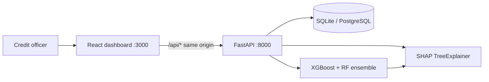
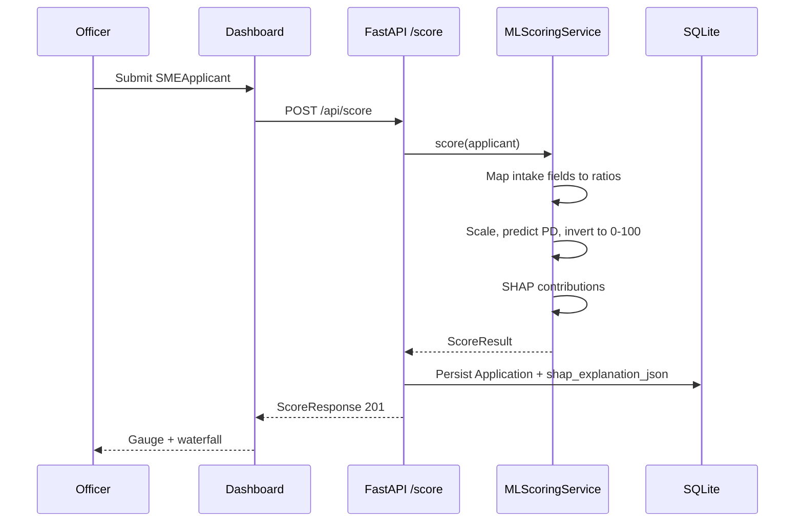
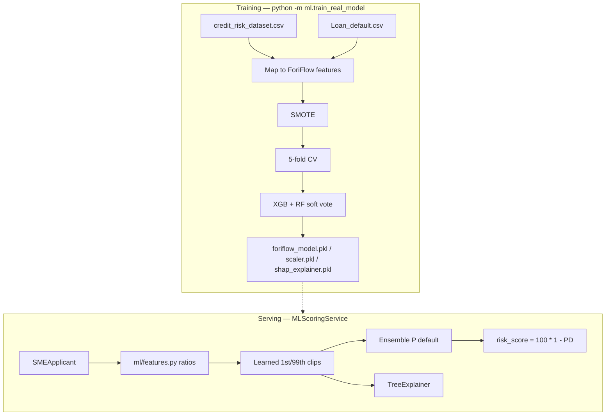
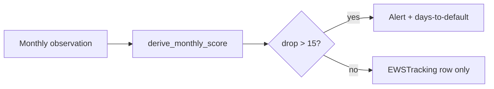
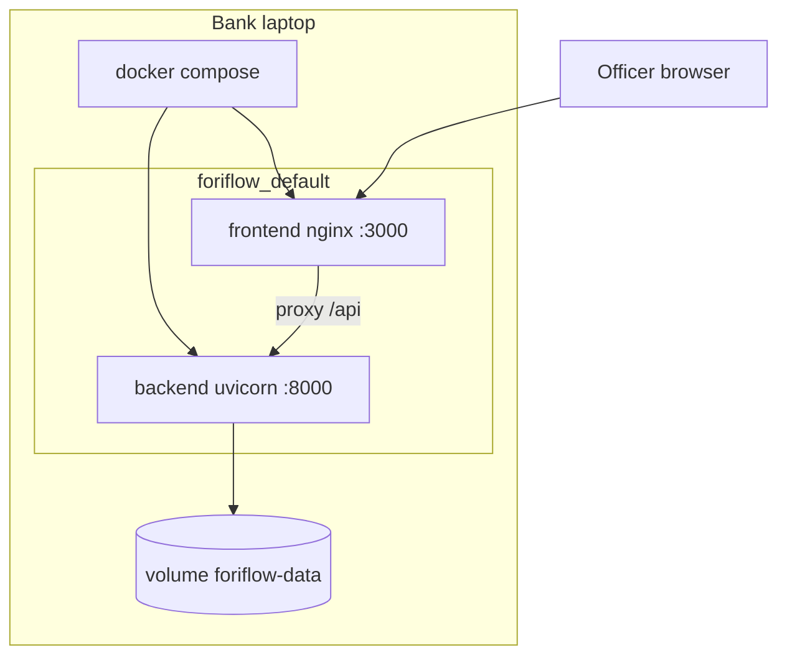

# ForiFlow architecture

ForiFlow is a two-process credit-intelligence stack: a FastAPI scoring service
and a React officer dashboard. The machine-learning artefacts live beside the
API so a bank can run the whole system on one laptop, with no cloud dependency.

## System context

In Docker, nginx serves the built SPA and proxies `/api` to the backend
container, stripping the prefix. Locally, Vite does the same rewrite so the
Axios client always uses the relative base `/api`.

## Request path for a new application

Policy bands are fixed in one place (`Decision` in `backend/schemas.py`):

| Score | Decision | Risk band |
|------:|----------|-----------|
| 0–40 | Rejected | High Risk |
| 41–70 | Manual Review | Medium Risk |
| 71–100 | Approved | Low Risk |

## Machine-learning pipeline

Design constraints that matter in production:

- **Currency invariance.** Training data is USD; ForiFlow underwrites in PKR.
  Features are ratios, scores, or durations — never raw amounts.
- **Turnover, not net cash flow,** is the income denominator. Using net profit
  would push healthy SMEs into the high loan-to-income tail.
- **Age is excluded.** The intake form never collects it, so training on it
  would bake a fabricated constant into every live score.
- **Monotone constraints** on the XGBoost member stop a clean payment history
  from increasing predicted risk.

When artefacts are missing the API falls back to a linear surrogate
(`ScoringService`) so the dashboard still boots on a fresh clone. Set
`FORIFLOW_SCORING_ENGINE=ml` to refuse that fallback.

## Early Warning System

`POST /ews/monitor` records one borrower-month. The baseline is the originating
application score. A drop greater than 15 points opens an `Active` alert with
an estimated days-to-default used by the officer queue.

## Deployment

Images: `foriflow-backend:1.0.0` (`python:3.11-slim` + `libgomp1`) and
`foriflow-frontend:1.0.0` (Node 20 build, nginx 1.27). See
[deployment.md](deployment.md).

## Repository map

| Path | Responsibility |
|------|----------------|
| `backend/main.py` | App factory, CORS, lifespan (eager model load) |
| `backend/routers/` | `/score`, `/explain`, `/ews` |
| `backend/services/` | Scoring engines and EWS rules |
| `backend/ml/` | Feature schema, training, artefacts |
| `frontend/src/pages/` | Five officer workspaces |
| `frontend/src/api/client.js` | Axios client, base `/api` |
| `docker-compose.yml` | Demo stack and healthchecks |
