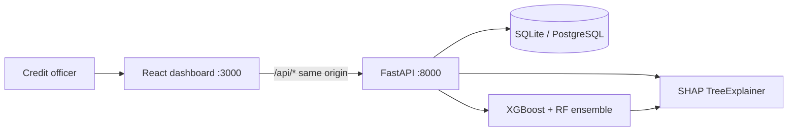
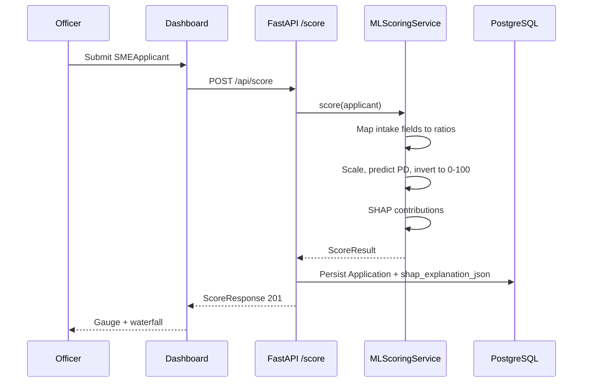
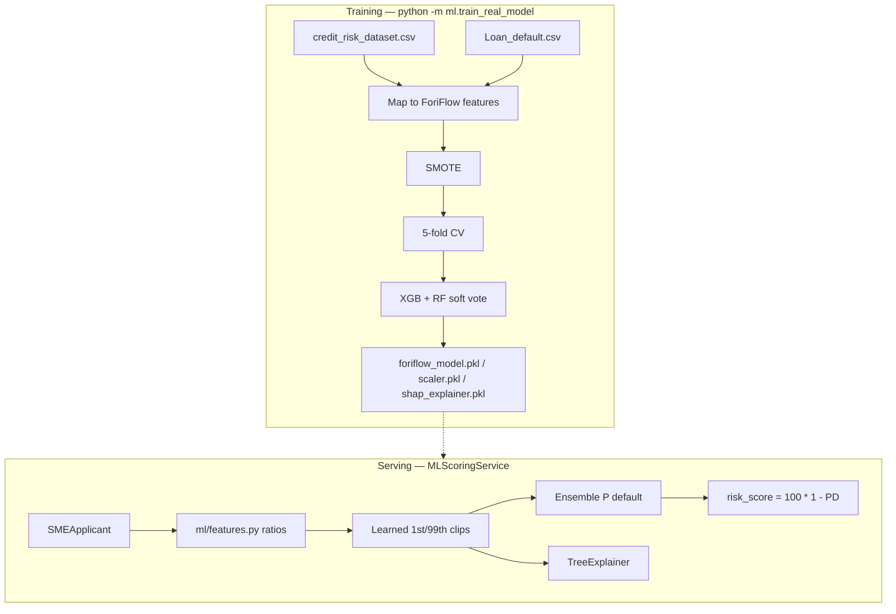
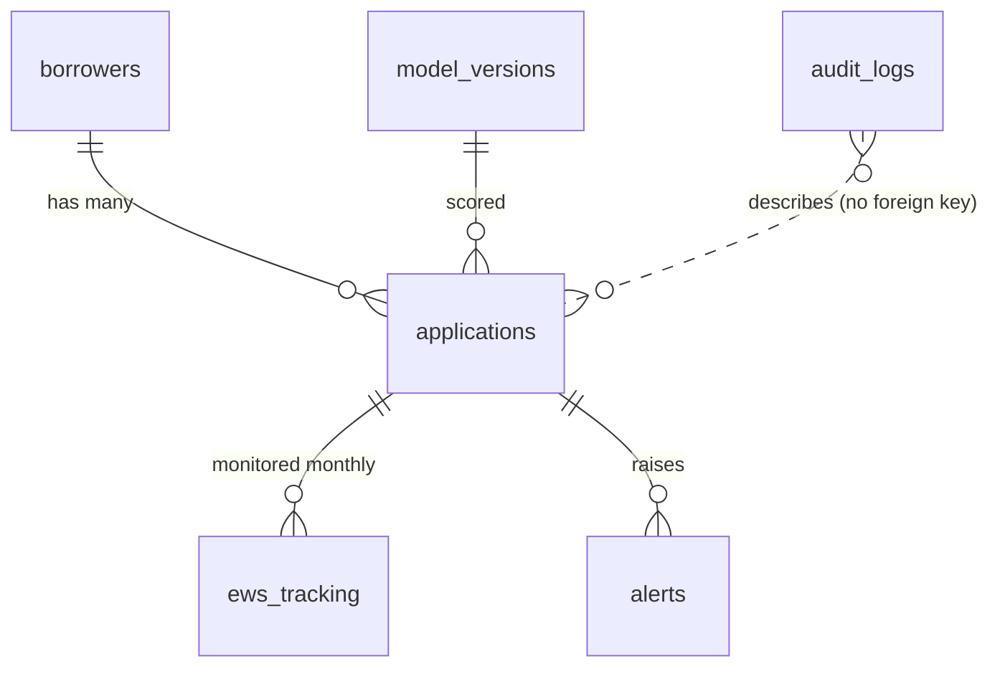
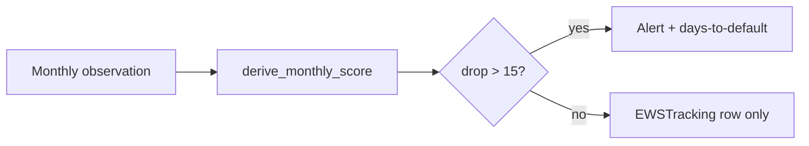
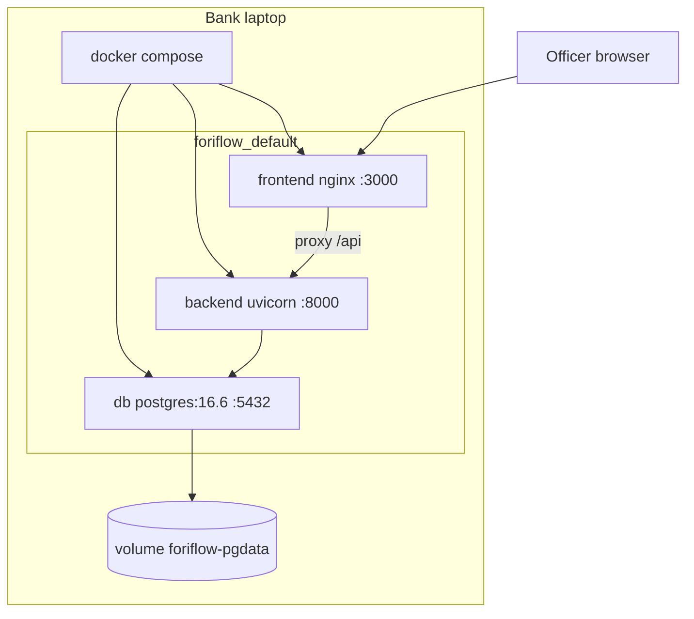

# ForiFlow architecture

ForiFlow is a three-container credit-intelligence stack: a FastAPI scoring
service, a React officer dashboard served by nginx, and PostgreSQL 16. The machine-learning artefacts live beside the
API so a bank can run the whole system on one laptop, with no cloud dependency.

## System context

```mermaid
flowchart LR
    officer[Credit officer]
    ui[React dashboard :3000]
    api[FastAPI :8000]
    db[(SQLite / PostgreSQL)]
    model[XGBoost + RF ensemble]
    shap[SHAP TreeExplainer]

    officer --> ui
    ui -->|"/api/* same origin"| api
    api --> db
    api --> model
    api --> shap
    model --> shap
```

In Docker, nginx serves the built SPA and proxies `/api` to the backend
container, stripping the prefix. Locally, Vite does the same rewrite so the
Axios client always uses the relative base `/api`.

## Request path for a new application

```mermaid
sequenceDiagram
    participant Officer
    participant Dashboard
    participant API as FastAPI /score
    participant Engine as MLScoringService
    participant DB as PostgreSQL

    Officer->>Dashboard: Submit SMEApplicant
    Dashboard->>API: POST /api/score
    API->>Engine: score(applicant)
    Engine->>Engine: Map intake fields to ratios
    Engine->>Engine: Scale, predict PD, invert to 0-100
    Engine->>Engine: SHAP contributions
    Engine-->>API: ScoreResult
    API->>DB: Persist Application + shap_explanation_json
    API-->>Dashboard: ScoreResponse 201
    Dashboard-->>Officer: Gauge + waterfall
```

Policy bands are fixed in one place (`Decision` in `backend/schemas.py`):

| Score | Decision | Risk band |
|------:|----------|-----------|
| 0–40 | Rejected | High Risk |
| 41–70 | Manual Review | Medium Risk |
| 71–100 | Approved | Low Risk |

## Machine-learning pipeline

```mermaid
flowchart TB
    subgraph train [Training — python -m ml.train_real_model]
        csv1[credit_risk_dataset.csv]
        csv2[Loan_default.csv]
        map[Map to ForiFlow features]
        smote[SMOTE]
        cv[5-fold CV]
        ens[XGB + RF soft vote]
        art[foriflow_model.pkl / scaler.pkl / shap_explainer.pkl]
        csv1 --> map
        csv2 --> map
        map --> smote --> cv --> ens --> art
    end

    subgraph serve [Serving — MLScoringService]
        intake[SMEApplicant]
        feat[ml/features.py ratios]
        clip[Learned 1st/99th clips]
        pred[Ensemble P default]
        score[risk_score = 100 * 1 - PD]
        shap2[TreeExplainer]
        intake --> feat --> clip --> pred --> score
        clip --> shap2
    end

    art -.-> serve
```

Design constraints that matter in production:

- **Currency invariance.** Training data is USD; ForiFlow underwrites in PKR.
  Features are ratios, scores, or durations — never raw amounts.
- **Turnover, not net cash flow,** is the income denominator. Using net profit
  would push healthy SMEs into the high loan-to-income tail.
- **Age is excluded.** The intake form never collects it, so training on it
  would bake a fabricated constant into every live score.
- **Monotone constraints** on both ensemble members (XGBoost
  `monotone_constraints`, RandomForest `monotonic_cst`) mean a larger facility,
  a weaker repayment record or fewer years in operation can never lower
  predicted risk, so the served score is monotone in every model input.

The trained artefacts are committed. If they are missing or fail to load the
API falls back to a linear surrogate (`ScoringService`) so the dashboard still
boots. That is never silent: the reason is logged as an error at startup,
reported by `GET /health`, stored on the model record, and every score made in
that state is stored with `scoring_engine = 'surrogate'`. Set
`FORIFLOW_SCORING_ENGINE=ml` to refuse the fallback altogether.

## Traceability: borrowers, audit trail, model versions

Added in 1.10.0 (migration `0006`). ForiFlow is a decision-support system, so
every score has to be traceable to a business, a model and an officer.

```mermaid
erDiagram
    borrowers ||--o{ applications : "has many"
    model_versions ||--o{ applications : "scored"
    applications ||--o{ ews_tracking : "monitored monthly"
    applications ||--o{ alerts : "raises"
    audit_logs }o..o{ applications : "describes (no foreign key)"
```

### Borrower → applications

A **borrower** is the business. An **application** is one request by that
business, with its own score, model version, monthly monitoring and alerts.
`applications.borrower_id` is `NOT NULL` with `ON DELETE RESTRICT`: an
application always has a borrower, and a borrower with applications can only be
marked `inactive`, never removed.

`POST /score` files the application under a borrower by the first rule that
applies:

1. `borrower_public_id` (e.g. `BRW-000012`) names the borrower.
2. Otherwise a CNIC or NTN finds the borrower already holding it.
3. Otherwise a new borrower is opened from the application's own details.

**A name never links two applications.** Two shops can share a name, and a
wrong link would put one business's repayment history under another. Only an
officer's explicit reference or a matching identifier links them.

The identifier is optional, stored as digits, unique when present (many
borrowers may have none), returned masked (`*********5671`), masked in the audit
trail, and never accepted in a URL. The model does not read it.

`GET /borrowers/{ref}/history` returns every application of a borrower, oldest
first: score, band, officer decision, model version and engine, monitored
months and alerts, with a summary.

> **Naming.** `alerts.borrower_id`, `ews_tracking.borrower_id` and the
> `borrower_id` field of the `/ews` routes are the **application** (facility)
> id. They predate the borrower table and are unchanged so existing clients
> keep working. `applications.borrower_id` is the business.

### Audit trail

`audit_logs` records who did what, to which record, and when: logins (both
outcomes), officer accounts, borrowers, applications, scores, explanations,
officer decisions (and refused approvals), monthly observations, alerts, and
model registration.

| Column | Meaning |
|---|---|
| `occurred_at`, `user_id`, `username`, `role` | When, and who, as they were at the time |
| `action` | `entity.verb`, e.g. `application.scored`, `ews.observation_updated` |
| `entity_type`, `entity_id` | The record acted on |
| `previous_state`, `new_state`, `details` | JSONB: before, after, and context |
| `ip_address`, `request_id` | Caller address and the request's `X-Request-ID` |

Design rules:

- **Same transaction.** An entry is added to the session that makes the change,
  so the change and its entry commit together or not at all. The two exceptions
  are a failed login and a refused approval: those entries are committed before
  the error is returned.
- **Append-only, enforced twice.** The ORM raises on any update or delete of an
  `AuditLog`. The database refuses `UPDATE`, `DELETE` and `TRUNCATE` through
  triggers, so a bulk statement or a hand-typed query fails too. A wrong entry
  is corrected by writing another entry.
- **No write API.** `GET /audit/logs` (admin) is the only route.
- **No secrets.** Keys that look like credentials are replaced before storage;
  passwords and tokens are never passed in; identifiers are masked.
- **No foreign key on `user_id`.** The entry must outlive the account, and it
  carries the username and role itself.
- A re-submitted month still overwrites its `ews_tracking` row (unchanged
  behaviour). The figures it replaced are kept in the
  `ews.observation_updated` entry.

Limits: a database superuser can drop the triggers; protecting against that
needs database-level access control or log shipping, which are deployment
concerns. `ip_address` behind the bundled nginx is taken from `X-Real-IP` and
is only as trustworthy as the network between the proxy and the API.

### Model versions

Each application stores, at scoring time and permanently:

| Column | Example |
|---|---|
| `model_version` | `ensemble-xgb-rf-credit_risk_shared-2026-09-25T10:38:26` |
| `scoring_engine` | `ml` (trained ensemble) or `surrogate` (fallback formula) |
| `model_version_id` | row in `model_versions` |

`model_versions` holds one row per model that has scored against this database:
version, engine, `artifact_sha256` (SHA-256 over the model, scaler, explainer
and feature-metadata files; for the surrogate, over its weights and bounds),
training dataset, feature list and its fingerprint, trained date, recorded
metrics, `status` (`active` or `retired`) and, for a surrogate, why it was
serving. A row is created the first time a model scores or at startup; the
previously active row is retired. The same version string with different files
is a different row.

Recomputing an explanation (`POST /explain/{id}?refresh=true`) uses the model
serving now and never changes what the application recorded.

### Migration notes (0006)

- No existing row is deleted or rewritten.
- **One borrower per existing application**, created in application-id order
  from that application's own names, contact number, sector and years in
  operation; `public_id` is `BRW-` plus the borrower id. Nothing is merged,
  because release 1.9 held no identifier that could justify it.
- `model_version` is copied from the explanation stored with each application
  and `scoring_engine` read from it. Where none is readable both stay `NULL`.
  `model_version_id` stays `NULL` for all pre-1.10 rows: the artefact
  fingerprint was not recorded then.
- The migration writes one `migration.applied` audit entry with the counts.
- PostgreSQL runs it in one transaction. Take a `pg_dump` first anyway.
- `python -m scripts.migrate_sqlite_to_postgres` applies the same borrower rule
  when it copies a pre-1.10 SQLite file.

## Early Warning System

```mermaid
flowchart LR
    month[Monthly observation] --> derive[derive_monthly_score]
    derive --> drop{drop > 15?}
    drop -->|yes| alert[Alert + days-to-default]
    drop -->|no| track[EWSTracking row only]
```

`POST /ews/monitor` records one borrower-month. Only an approved facility can be
monitored: Approved by the model, or Manual Review approved by an officer
(anything else is `409`), and only up to the facility's tenure. The baseline is
the originating application score. When the latest month drops more than 15
points, an `Active` alert opens (or the open one is updated) with an estimated
days-to-default. Back-filling an older month never rewrites the alert; if a
correction brings the alerting month back within the threshold, the alert is
closed with a note. Any officer can take an alert `In Review`; an admin
resolves it with a note.

## Deployment

```mermaid
flowchart TB
    subgraph host [Bank laptop]
        compose[docker compose]
        subgraph net [foriflow_default]
            fe[frontend nginx :3000]
            be[backend uvicorn :8000]
            db[db postgres:16.6 :5432]
        end
        vol[(volume foriflow-pgdata)]
        compose --> fe
        compose --> be
        compose --> db
        fe -->|proxy /api| be
        be --> db
        db --> vol
    end
    officer[Officer browser] --> fe
```

Images: `foriflow-backend:1.10.0` (`python:3.12-slim` + `libgomp1`) and
`foriflow-frontend:1.10.0` (Node 20 build, nginx 1.27). See
[deployment.md](deployment.md).

## Repository map

| Path | Responsibility |
|------|----------------|
| `backend/main.py` | App factory, CORS, lifespan (eager model load) |
| `backend/routers/` | `/auth`, `/score` (incl. Manual Review decision and stats), `/explain`, `/ews`, `/borrowers`, `/audit`, `/model`, `/portfolio` |
| `backend/services/` | Scoring engines, EWS rules, auth (bcrypt, JWT, roles), borrowers, audit trail, model registry |
| `backend/alembic/` | PostgreSQL schema migrations (0001–0005) |
| `backend/ml/` | Feature schema, training, artefacts |
| `frontend/src/pages/` | Five officer workspaces |
| `frontend/src/api/client.js` | Axios client, base `/api` |
| `docker-compose.yml` | Demo stack and healthchecks |
