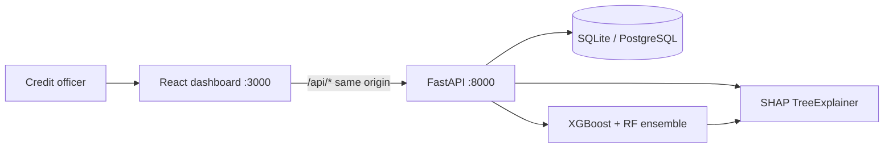
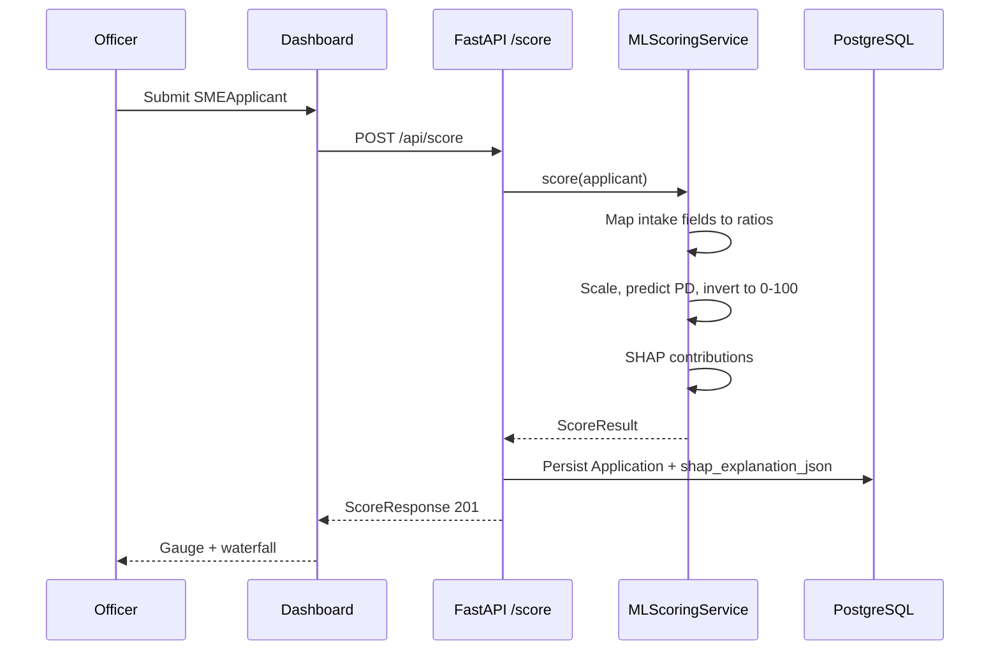
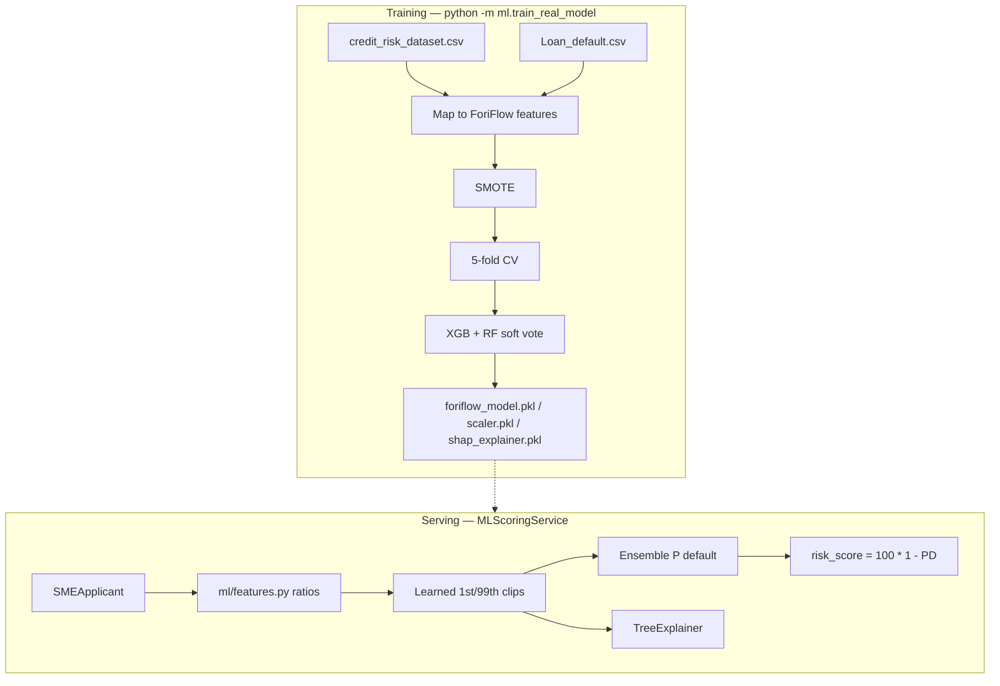
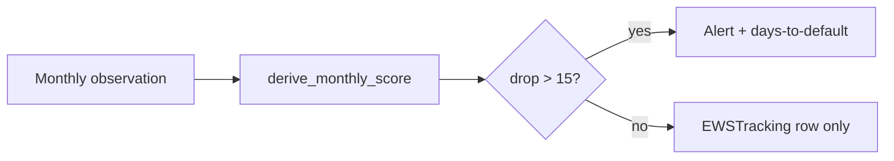
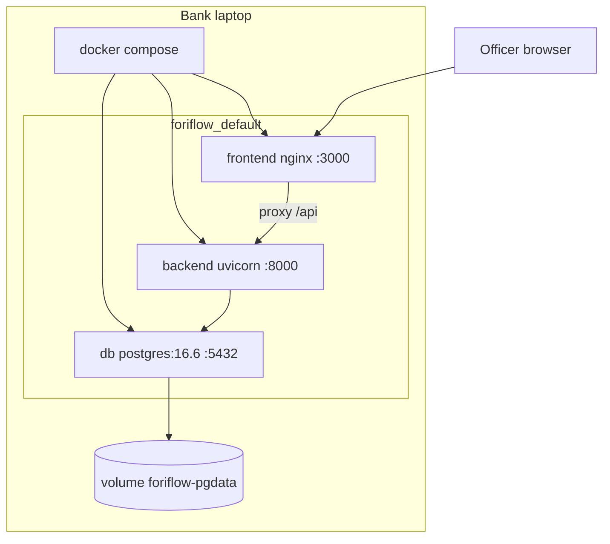

# ForiFlow architecture

ForiFlow is a three-container credit-intelligence stack: a FastAPI scoring
service, a React officer dashboard served by nginx, and PostgreSQL 16. The machine-learning artefacts live beside the
API so a bank can run the whole system on one laptop, with no cloud dependency.

## System context

```mermaid
flowchart LR
    officer[Credit officer]
    ui[React dashboard :3000]
    api[FastAPI :8000]
    db[(SQLite / PostgreSQL)]
    model[XGBoost + RF ensemble]
    shap[SHAP TreeExplainer]

    officer --> ui
    ui -->|"/api/* same origin"| api
    api --> db
    api --> model
    api --> shap
    model --> shap
```

In Docker, nginx serves the built SPA and proxies `/api` to the backend
container, stripping the prefix. Locally, Vite does the same rewrite so the
Axios client always uses the relative base `/api`.

## Request path for a new application

```mermaid
sequenceDiagram
    participant Officer
    participant Dashboard
    participant API as FastAPI /score
    participant Engine as MLScoringService
    participant DB as PostgreSQL

    Officer->>Dashboard: Submit SMEApplicant
    Dashboard->>API: POST /api/score
    API->>Engine: score(applicant)
    Engine->>Engine: Map intake fields to ratios
    Engine->>Engine: Scale, predict PD, invert to 0-100
    Engine->>Engine: SHAP contributions
    Engine-->>API: ScoreResult
    API->>DB: Persist Application + shap_explanation_json
    API-->>Dashboard: ScoreResponse 201
    Dashboard-->>Officer: Gauge + waterfall
```

Policy bands are fixed in one place (`Decision` in `backend/schemas.py`):

| Score | Decision | Risk band |
|------:|----------|-----------|
| 0–40 | Rejected | High Risk |
| 41–70 | Manual Review | Medium Risk |
| 71–100 | Approved | Low Risk |

## Machine-learning pipeline

```mermaid
flowchart TB
    subgraph train [Training — python -m ml.train_real_model]
        csv1[credit_risk_dataset.csv]
        csv2[Loan_default.csv]
        map[Map to ForiFlow features]
        smote[SMOTE]
        cv[5-fold CV]
        ens[XGB + RF soft vote]
        art[foriflow_model.pkl / scaler.pkl / shap_explainer.pkl]
        csv1 --> map
        csv2 --> map
        map --> smote --> cv --> ens --> art
    end

    subgraph serve [Serving — MLScoringService]
        intake[SMEApplicant]
        feat[ml/features.py ratios]
        clip[Learned 1st/99th clips]
        pred[Ensemble P default]
        score[risk_score = 100 * 1 - PD]
        shap2[TreeExplainer]
        intake --> feat --> clip --> pred --> score
        clip --> shap2
    end

    art -.-> serve
```

Design constraints that matter in production:

- **Currency invariance.** Training data is USD; ForiFlow underwrites in PKR.
  Features are ratios, scores, or durations — never raw amounts.
- **Turnover, not net cash flow,** is the income denominator. Using net profit
  would push healthy SMEs into the high loan-to-income tail.
- **Age is excluded.** The intake form never collects it, so training on it
  would bake a fabricated constant into every live score.
- **Monotone constraints** on both ensemble members (XGBoost
  `monotone_constraints`, RandomForest `monotonic_cst`) mean a larger facility,
  a weaker repayment record or fewer years in operation can never lower
  predicted risk, so the served score is monotone in every model input.

The trained artefacts are committed. If they are missing the API falls back to
a linear surrogate (`ScoringService`) so the dashboard still boots. Set
`FORIFLOW_SCORING_ENGINE=ml` to refuse that fallback.

## Early Warning System

```mermaid
flowchart LR
    month[Monthly observation] --> derive[derive_monthly_score]
    derive --> drop{drop > 15?}
    drop -->|yes| alert[Alert + days-to-default]
    drop -->|no| track[EWSTracking row only]
```

`POST /ews/monitor` records one borrower-month. Only an approved facility can be
monitored: Approved by the model, or Manual Review approved by an officer
(anything else is `409`), and only up to the facility's tenure. The baseline is
the originating application score. When the latest month drops more than 15
points, an `Active` alert opens (or the open one is updated) with an estimated
days-to-default. Back-filling an older month never rewrites the alert; if a
correction brings the alerting month back within the threshold, the alert is
closed with a note. Any officer can take an alert `In Review`; an admin
resolves it with a note.

## Deployment

```mermaid
flowchart TB
    subgraph host [Bank laptop]
        compose[docker compose]
        subgraph net [foriflow_default]
            fe[frontend nginx :3000]
            be[backend uvicorn :8000]
            db[db postgres:16.6 :5432]
        end
        vol[(volume foriflow-pgdata)]
        compose --> fe
        compose --> be
        compose --> db
        fe -->|proxy /api| be
        be --> db
        db --> vol
    end
    officer[Officer browser] --> fe
```

Images: `foriflow-backend:1.7.1` (`python:3.12-slim` + `libgomp1`) and
`foriflow-frontend:1.7.1` (Node 20 build, nginx 1.27). See
[deployment.md](deployment.md).

## Repository map

| Path | Responsibility |
|------|----------------|
| `backend/main.py` | App factory, CORS, lifespan (eager model load) |
| `backend/routers/` | `/auth`, `/score` (incl. Manual Review decision and stats), `/explain`, `/ews` |
| `backend/services/` | Scoring engines, EWS rules, auth (bcrypt, JWT, roles) |
| `backend/alembic/` | PostgreSQL schema migrations (0001–0005) |
| `backend/ml/` | Feature schema, training, artefacts |
| `frontend/src/pages/` | Five officer workspaces |
| `frontend/src/api/client.js` | Axios client, base `/api` |
| `docker-compose.yml` | Demo stack and healthchecks |
