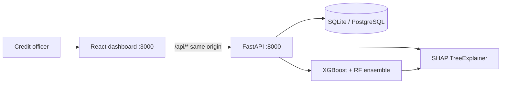
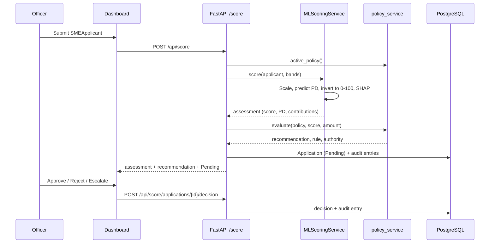
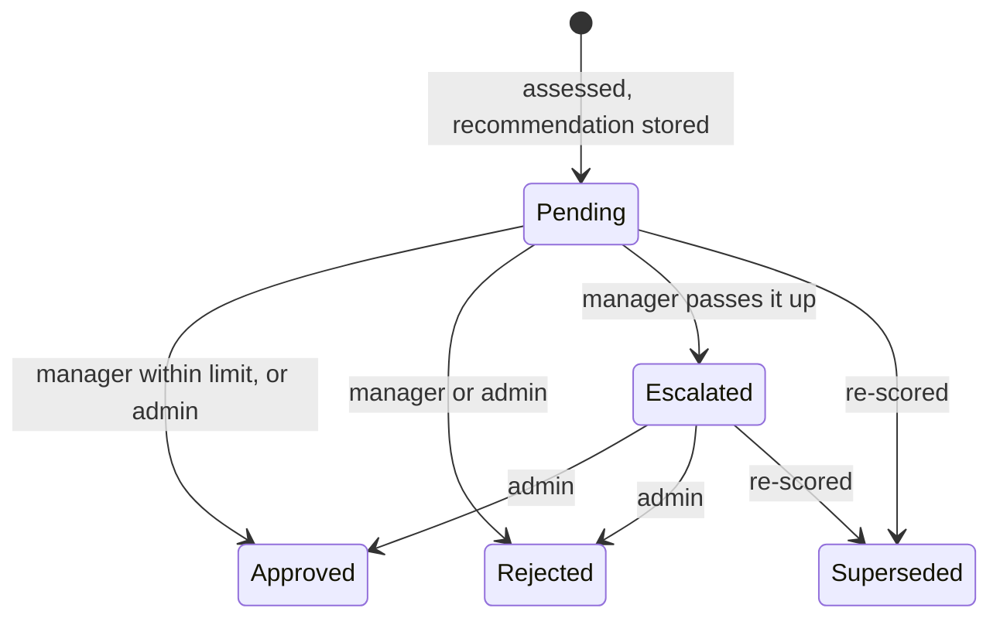
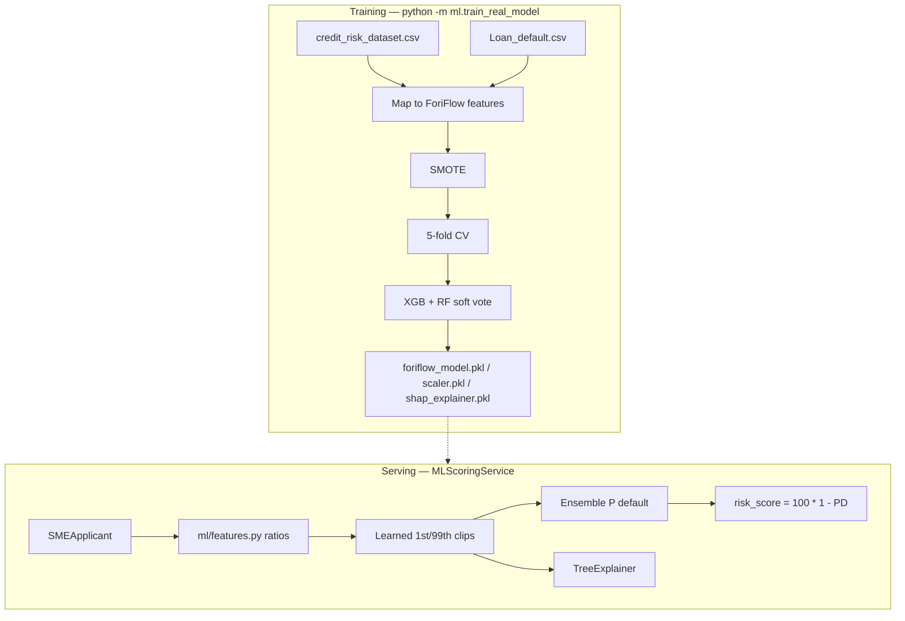
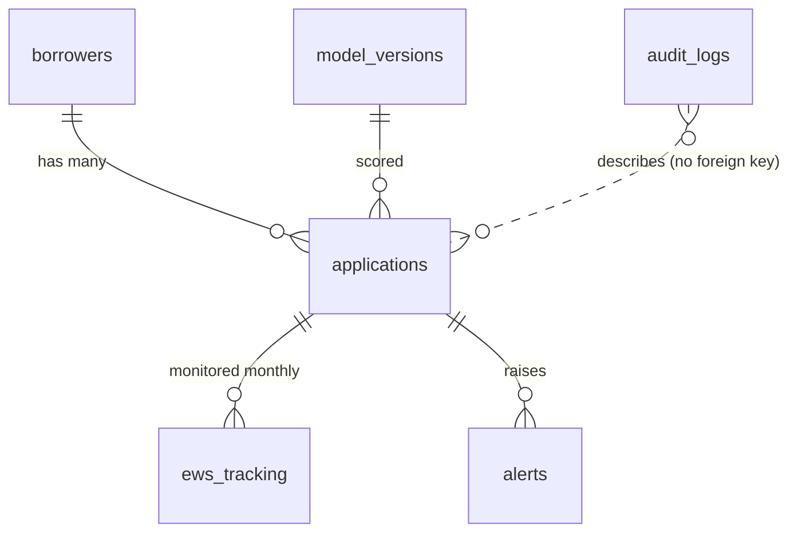
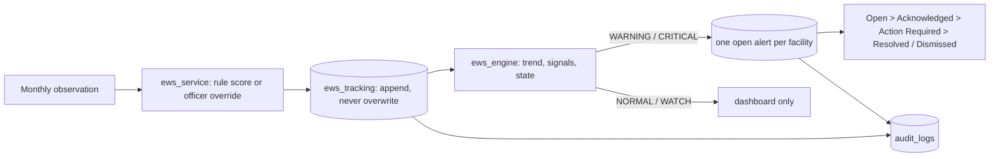
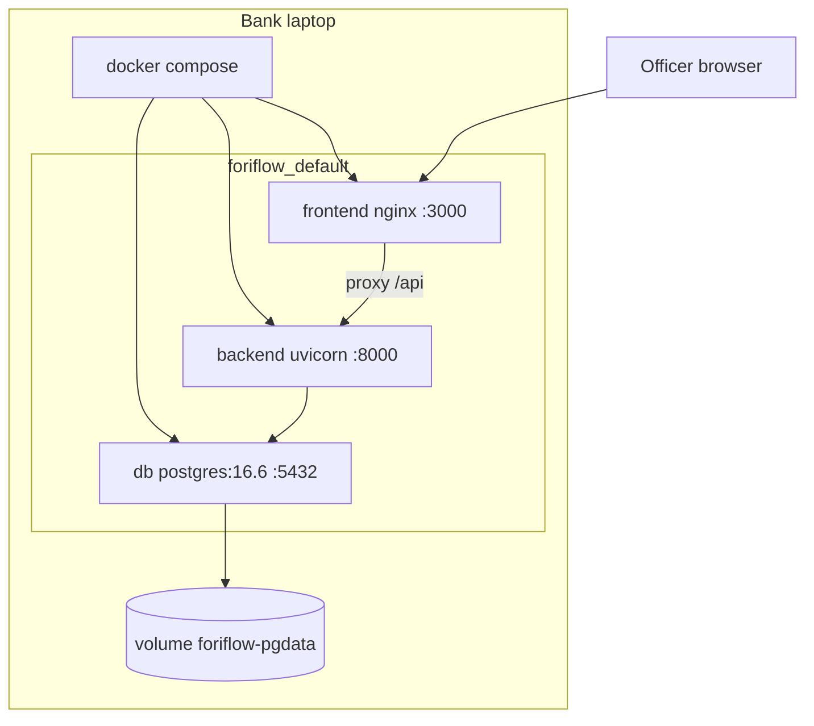

# ForiFlow architecture

ForiFlow is a three-container credit-intelligence stack: a FastAPI scoring
service, a React officer dashboard served by nginx, and PostgreSQL 16. The machine-learning artefacts live beside the
API so a bank can run the whole system on one laptop, with no cloud dependency.

## System context

```mermaid
flowchart LR
    officer[Credit officer]
    ui[React dashboard :3000]
    api[FastAPI :8000]
    db[(SQLite / PostgreSQL)]
    model[XGBoost + RF ensemble]
    shap[SHAP TreeExplainer]

    officer --> ui
    ui -->|"/api/* same origin"| api
    api --> db
    api --> model
    api --> shap
    model --> shap
```

In Docker, nginx serves the built SPA and proxies `/api` to the backend
container, stripping the prefix. Locally, Vite does the same rewrite so the
Axios client always uses the relative base `/api`.

## Request path for a new application

```mermaid
sequenceDiagram
    participant Officer
    participant Dashboard
    participant API as FastAPI /score
    participant Engine as MLScoringService
    participant Policy as policy_service
    participant DB as PostgreSQL

    Officer->>Dashboard: Submit SMEApplicant
    Dashboard->>API: POST /api/score
    API->>Policy: active_policy()
    API->>Engine: score(applicant, bands)
    Engine->>Engine: Scale, predict PD, invert to 0-100, SHAP
    Engine-->>API: assessment (score, PD, contributions)
    API->>Policy: evaluate(policy, score, amount)
    Policy-->>API: recommendation, rule, authority
    API->>DB: Application (Pending) + audit entries
    API-->>Dashboard: assessment + recommendation + Pending
    Officer->>Dashboard: Approve / Reject / Escalate
    Dashboard->>API: POST /api/score/applications/{id}/decision
    API->>DB: decision + audit entry
```

## Model, policy, human

ForiFlow is a credit decision-support system. It does not approve or reject a
loan. Since 2.0.0 the three roles are separate in the code, the database and
the API:

| Layer | Code | Produces | Stored on the application |
|---|---|---|---|
| **Model** | `services/scoring_service.py` | Risk score 0-100, raw and calibrated probability of default, SHAP contributions | `risk_score`, `raw_pd`, `calibrated_pd`, `model_version`, `scoring_engine`, `shap_explanation_json` |
| **Policy** | `services/policy_rules.py` (pure rules), `services/policy_service.py` (versions) | Risk band, a **recommendation** (Approve / Manual Review / Decline), who may approve, the rule that applied | `risk_band`, `decision`, `policy_id`, `policy_version`, `policy_evaluation`, `reason_codes` |
| **Human** | `services/decision_service.py` | The **decision**: Approved or Rejected, by a named officer, with a reason | `decision_status`, `review_decision`, `review_note`, `reviewed_by`, `reviewed_at`, escalation fields |

`decision` keeps the wording it has had since 1.0 (`Approved`, `Manual Review`,
`Rejected`) so existing clients and data keep working, but it now means only
"the policy recommends this". The API also returns it as `recommendation`
(`Approve`, `Manual Review`, `Decline`). Nothing is approved or rejected until
an officer records it.

### Credit policy

`credit_policies` holds versioned policy configuration:

| Field | Demo policy v1.0 | Meaning |
|---|---|---|
| `decline_max_score` | 40 | Score at or below: recommend Decline (High Risk) |
| `manual_review_max_score` | 70 | Above that and at or below: recommend Manual Review (Medium Risk); above: recommend Approve (Low Risk) |
| `manager_approval_limit_pkr` | 2,000,000 | Largest facility a manager may approve alone |
| `decline_override_admin_only` | true | Approving against a Decline recommendation needs an admin |

**These are demo values.** They are the round numbers ForiFlow has always used.
They were not derived from data, were not tuned on the hold-out set, and are
not validated thresholds for Pakistani SME lending. A lender sets its own.

Rules:

- One version is active (a partial unique index enforces it). New assessments
  use the active version.
- A version's figures are **never edited and never deleted**. A change is a new
  version (`POST /policy/versions`, admin), created as a draft, then activated
  (`POST /policy/versions/{id}/activate`, admin), which retires the previous one.
- Each application stores the policy version **and a snapshot of the rule that
  applied** (`policy_evaluation`: cut-offs, triggered rule, authority limit). A
  later policy cannot change what a past application was recommended, and an
  application is decided under the authority limits it was assessed under.
- Every create, activate and retire is written to the audit trail.
- `MANAGER_APPROVAL_LIMIT_PKR` only sets the limit of the first (demo) policy
  when it is created. After that the policy is the single source.
- The dashboard holds no cut-off. The score dial draws each application with
  the bands from its own snapshot (`policy.bands`; `legacy_fixed_rule` for
  applications scored before 2.0) and an empty dial with the active policy;
  the histogram is cut on the active policy by the API. The Model Performance
  page's 40 / 70 are model evaluation cut-offs and are labelled so.
- The EWS thresholds are monitoring rules, not credit-decision policy. Since
  2.1 they live in `services/ews_engine.py` and are served by
  `GET /ews/methodology` (see [ews.md](ews.md)).

### Decision workflow

```mermaid
stateDiagram-v2
    [*] --> Pending: assessed, recommendation stored
    Pending --> Approved: manager within limit, or admin
    Pending --> Rejected: manager or admin
    Pending --> Escalated: manager passes it up
    Escalated --> Approved: admin
    Escalated --> Rejected: admin
    Pending --> Superseded: re-scored
    Escalated --> Superseded: re-scored
```

Authority is enforced in `decision_service.record_action`, on the server:

| Action | Analyst | Manager | Admin |
|---|---|---|---|
| Approve, facility within the manager limit | no | yes | yes |
| Approve, facility above the limit | no | no (`403`) | yes |
| Approve against a Decline recommendation | no | only if the policy allows | yes |
| Reject | no | yes | yes |
| Escalate to an admin | no | yes | not applicable |
| Anything on an escalated application | no | no (`403`) | yes |

A written reason (10 to 1000 characters) is always required. A decision is
recorded once and is not changed (`409`). A refused action is itself audited.
Only an approved application can be monitored by the EWS.

### Re-scoring

An application's assessment is never overwritten. `POST /score` with
`rescore_of_application_id` stores a **new** application linked to the earlier
one (`supersedes_application_id` / `superseded_by_application_id`); the earlier
one keeps its score, explanation, model version and policy version and is
marked `Superseded`. Only an undecided application can be re-scored. The audit
entry `application.rescored` records who did it, both assessments, and exactly
which inputs changed. Every new application also records how many earlier
applications the borrower already has. `GET /score/applications/{id}/decision-history`
returns the whole chain and its events.

### Reason codes

`services/reason_codes.py` is a deterministic layer on top of SHAP; it does not
replace it. Rule: take the SHAP contributions, keep those that lowered the score
by at least 0.5 points, order them largest first, keep the top three, and give
each the fixed code of its feature. Codes exist only for features an
explanation can contain.

| Code | Meaning | Feature | Engine |
|---|---|---|---|
| R01 | Facility is large against annual turnover | `loan_to_income` | trained model |
| R02 | Adverse repayment history | `payment_history_score` | both |
| R03 | Short trading history | `years_in_operation` | both |
| R04 | Installment is high against turnover / cash flow | `installment_to_income`, `loan_affordability` | not in the served model / fallback |
| R05 | High existing debt burden | `debt_service_to_income`, `debt_burden` | not in the served model / fallback |
| R06 | Requested tenure adds risk | `tenure_months` | not in the served model |
| R07 | Low digital payment volume | `monthly_digital_payments` | fallback |
| R08 | Irregular order volumes | `order_consistency` | fallback |
| R09 | Slow inventory turnover | `inventory_turnover` | fallback |
| R10 | Very small business | `num_employees` | fallback |

The served model reads three features, so in practice it produces R01, R02 and
R03 only.

### Migration notes (0007)

- No row is deleted. No decision and no policy version is invented.
- Existing applications keep `policy_id` / `policy_version` **NULL**: no policy
  version was recorded when they were scored.
- `decision_status` is taken from each row's own columns under the rule in
  force when it was scored: an officer's Manual Review decision stays as it is
  (`decision_source = officer`); an undecided Manual Review is `Pending`; an
  Approved or Rejected band is that outcome with `decision_source =
  legacy_auto`, because before 2.0 the band alone was final. No officer is
  recorded for those, since none decided. Facilities already being monitored
  therefore stay approved.
- `calibrated_pd` is copied from the stored explanation where present;
  `raw_pd` was never stored and stays NULL.

## Machine-learning pipeline

```mermaid
flowchart TB
    subgraph train [Training — python -m ml.train_real_model]
        csv1[credit_risk_dataset.csv]
        csv2[Loan_default.csv]
        map[Map to ForiFlow features]
        smote[SMOTE]
        cv[5-fold CV]
        ens[XGB + RF soft vote]
        art[foriflow_model.pkl / scaler.pkl / shap_explainer.pkl]
        csv1 --> map
        csv2 --> map
        map --> smote --> cv --> ens --> art
    end

    subgraph serve [Serving — MLScoringService]
        intake[SMEApplicant]
        feat[ml/features.py ratios]
        clip[Learned 1st/99th clips]
        pred[Ensemble P default]
        score[risk_score = 100 * 1 - PD]
        shap2[TreeExplainer]
        intake --> feat --> clip --> pred --> score
        clip --> shap2
    end

    art -.-> serve
```

Design constraints that matter in production:

- **Currency invariance.** Training data is USD; ForiFlow underwrites in PKR.
  Features are ratios, scores, or durations — never raw amounts.
- **Turnover, not net cash flow,** is the income denominator. Using net profit
  would push healthy SMEs into the high loan-to-income tail.
- **Age is excluded.** The intake form never collects it, so training on it
  would bake a fabricated constant into every live score.
- **Monotone constraints** on both ensemble members (XGBoost
  `monotone_constraints`, RandomForest `monotonic_cst`) mean a larger facility,
  a weaker repayment record or fewer years in operation can never lower
  predicted risk, so the served score is monotone in every model input.

The trained artefacts are committed. If they are missing or fail to load the
API falls back to a linear surrogate (`ScoringService`) so the dashboard still
boots. That is never silent: the reason is logged as an error at startup,
reported by `GET /health`, stored on the model record, and every score made in
that state is stored with `scoring_engine = 'surrogate'`. Set
`FORIFLOW_SCORING_ENGINE=ml` to refuse the fallback altogether.

## Traceability: borrowers, audit trail, model versions

Added in 1.10.0 (migration `0006`). ForiFlow is a decision-support system, so
every score has to be traceable to a business, a model and an officer.

```mermaid
erDiagram
    borrowers ||--o{ applications : "has many"
    model_versions ||--o{ applications : "scored"
    applications ||--o{ ews_tracking : "monitored monthly"
    applications ||--o{ alerts : "raises"
    audit_logs }o..o{ applications : "describes (no foreign key)"
```

### Borrower → applications

A **borrower** is the business. An **application** is one request by that
business, with its own score, model version, monthly monitoring and alerts.
`applications.borrower_id` is `NOT NULL` with `ON DELETE RESTRICT`: an
application always has a borrower, and a borrower with applications can only be
marked `inactive`, never removed.

`POST /score` files the application under a borrower by the first rule that
applies:

1. `borrower_public_id` (e.g. `BRW-000012`) names the borrower.
2. Otherwise a CNIC or NTN finds the borrower already holding it.
3. Otherwise a new borrower is opened from the application's own details.

**A name never links two applications.** Two shops can share a name, and a
wrong link would put one business's repayment history under another. Only an
officer's explicit reference or a matching identifier links them.

The identifier is optional, stored as digits, unique when present (many
borrowers may have none), returned masked (`*********5671`), masked in the audit
trail, and never accepted in a URL. The model does not read it.

`GET /borrowers/{ref}/history` returns every application of a borrower, oldest
first: score, band, officer decision, model version and engine, monitored
months and alerts, with a summary.

> **Naming.** `alerts.borrower_id`, `ews_tracking.borrower_id` and the
> `borrower_id` field of the `/ews` routes are the **application** (facility)
> id. They predate the borrower table and are unchanged so existing clients
> keep working. `applications.borrower_id` is the business.

### Audit trail

`audit_logs` records who did what, to which record, and when: logins (both
outcomes), officer accounts, borrowers, applications, scores, explanations,
officer decisions (and refused approvals), monthly observations, alerts, and
model registration.

| Column | Meaning |
|---|---|
| `occurred_at`, `user_id`, `username`, `role` | When, and who, as they were at the time |
| `action` | `entity.verb`, e.g. `application.scored`, `ews.observation_updated` |
| `entity_type`, `entity_id` | The record acted on |
| `previous_state`, `new_state`, `details` | JSONB: before, after, and context |
| `ip_address`, `request_id` | Caller address and the request's `X-Request-ID` |

Design rules:

- **Same transaction.** An entry is added to the session that makes the change,
  so the change and its entry commit together or not at all. The two exceptions
  are a failed login and a refused approval: those entries are committed before
  the error is returned.
- **Append-only, enforced twice.** The ORM raises on any update or delete of an
  `AuditLog`. The database refuses `UPDATE`, `DELETE` and `TRUNCATE` through
  triggers, so a bulk statement or a hand-typed query fails too. A wrong entry
  is corrected by writing another entry.
- **No write API.** `GET /audit/logs` (admin) is the only route.
- **No secrets.** Keys that look like credentials are replaced before storage;
  passwords and tokens are never passed in; identifiers are masked.
- **No foreign key on `user_id`.** The entry must outlive the account, and it
  carries the username and role itself.
- A re-submitted month still overwrites its `ews_tracking` row (unchanged
  behaviour). The figures it replaced are kept in the
  `ews.observation_updated` entry.

Limits: a database superuser can drop the triggers; protecting against that
needs database-level access control or log shipping, which are deployment
concerns. `ip_address` behind the bundled nginx is taken from `X-Real-IP` and
is only as trustworthy as the network between the proxy and the API.

### Model versions

Each application stores, at scoring time and permanently:

| Column | Example |
|---|---|
| `model_version` | `ensemble-xgb-rf-credit_risk_shared-2026-09-25T10:38:26` |
| `scoring_engine` | `ml` (trained ensemble) or `surrogate` (fallback formula) |
| `model_version_id` | row in `model_versions` |

`model_versions` holds one row per model that has scored against this database:
version, engine, `artifact_sha256` (SHA-256 over the model, scaler, explainer
and feature-metadata files; for the surrogate, over its weights and bounds),
training dataset, feature list and its fingerprint, trained date, recorded
metrics, `status` (`active` or `retired`) and, for a surrogate, why it was
serving. A row is created the first time a model scores or at startup; the
previously active row is retired. The same version string with different files
is a different row.

Recomputing an explanation (`POST /explain/{id}?refresh=true`) uses the model
serving now and never changes what the application recorded.

### Migration notes (0006)

- No existing row is deleted or rewritten.
- **One borrower per existing application**, created in application-id order
  from that application's own names, contact number, sector and years in
  operation; `public_id` is `BRW-` plus the borrower id. Nothing is merged,
  because release 1.9 held no identifier that could justify it.
- `model_version` is copied from the explanation stored with each application
  and `scoring_engine` read from it. Where none is readable both stay `NULL`.
  `model_version_id` stays `NULL` for all pre-1.10 rows: the artefact
  fingerprint was not recorded then.
- The migration writes one `migration.applied` audit entry with the counts.
- PostgreSQL runs it in one transaction. Take a `pg_dump` first anyway.
- `python -m scripts.migrate_sqlite_to_postgres` applies the same borrower rule
  when it copies a pre-1.10 SQLite file.

## Early Warning System

```mermaid
flowchart LR
    month[Monthly observation] --> score[ews_service: rule score or officer override]
    score --> store[(ews_tracking: append, never overwrite)]
    store --> engine[ews_engine: trend, signals, state]
    engine -->|WARNING / CRITICAL| alert[(one open alert per facility)]
    engine -->|NORMAL / WATCH| list[dashboard only]
    alert --> life[Open > Acknowledged > Action Required > Resolved / Dismissed]
    store --> audit[(audit_logs)]
    alert --> audit
```

Since 2.1 the EWS is a deterministic layer, separate from the model and the
credit policy:

| Part | Code | Does |
|---|---|---|
| Monthly score | `services/ews_service.py` | Origination score minus fixed penalties (repayment bucket, bureau leverage, POS shortfall), or an officer override with a reason |
| Engine | `services/ews_engine.py` | Pure functions: trend (OLS slope from 3 months), six signals with evidence, the NORMAL / WATCH / WARNING / CRITICAL state, recommended actions |
| API | `routers/ews.py` | Stores observations (corrections supersede, never overwrite), keeps one open alert per facility, runs the lifecycle, audits every change |

The EWS state is not a credit risk band, and the EWS never changes a facility
or a credit decision. The thresholds are monitoring rules, not values fitted
on SME outcomes; the full method, the Markov chain's demotion to reference
only, the migration and the limits are in [ews.md](ews.md).

## Deployment

```mermaid
flowchart TB
    subgraph host [Bank laptop]
        compose[docker compose]
        subgraph net [foriflow_default]
            fe[frontend nginx :3000]
            be[backend uvicorn :8000]
            db[db postgres:16.6 :5432]
        end
        vol[(volume foriflow-pgdata)]
        compose --> fe
        compose --> be
        compose --> db
        fe -->|proxy /api| be
        be --> db
        db --> vol
    end
    officer[Officer browser] --> fe
```

Images: `foriflow-backend:2.1.0` (`python:3.12-slim` + `libgomp1`) and
`foriflow-frontend:2.1.0` (Node 20 build, nginx 1.27). See
[deployment.md](deployment.md).

## Repository map

| Path | Responsibility |
|------|----------------|
| `backend/main.py` | App factory, CORS, lifespan (eager model load) |
| `backend/routers/` | `/auth`, `/score` (incl. Manual Review decision and stats), `/explain`, `/ews`, `/borrowers`, `/audit`, `/model`, `/portfolio` |
| `backend/services/` | Scoring engines, EWS rules, auth (bcrypt, JWT, roles), borrowers, audit trail, model registry |
| `backend/alembic/` | PostgreSQL schema migrations (0001–0005) |
| `backend/ml/` | Feature schema, training, artefacts |
| `frontend/src/pages/` | Five officer workspaces |
| `frontend/src/api/client.js` | Axios client, base `/api` |
| `docker-compose.yml` | Demo stack and healthchecks |
